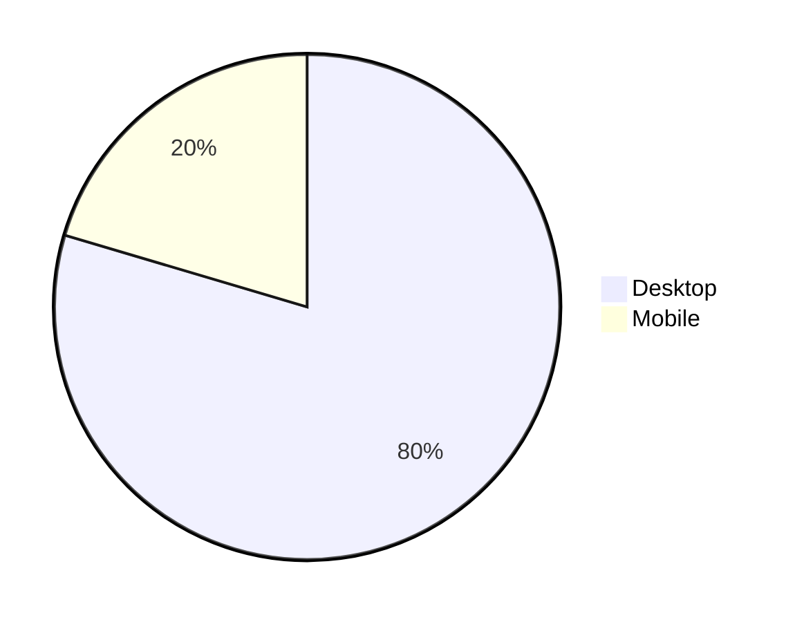
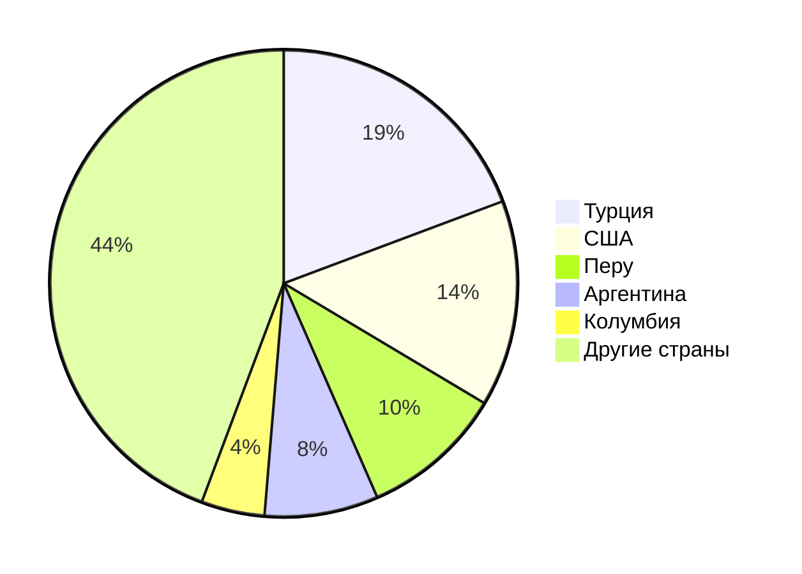
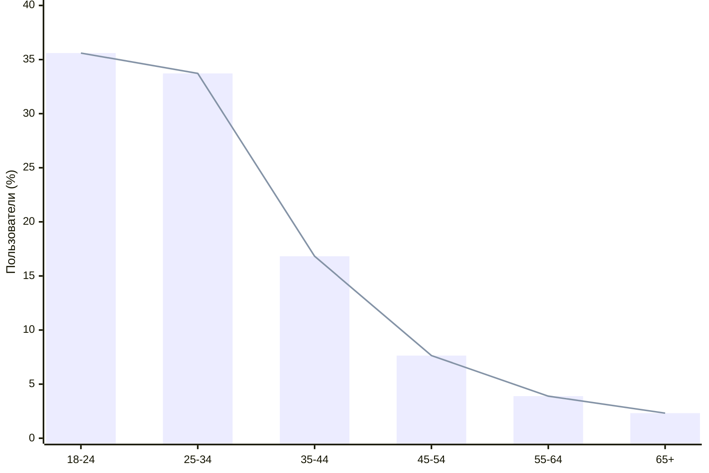
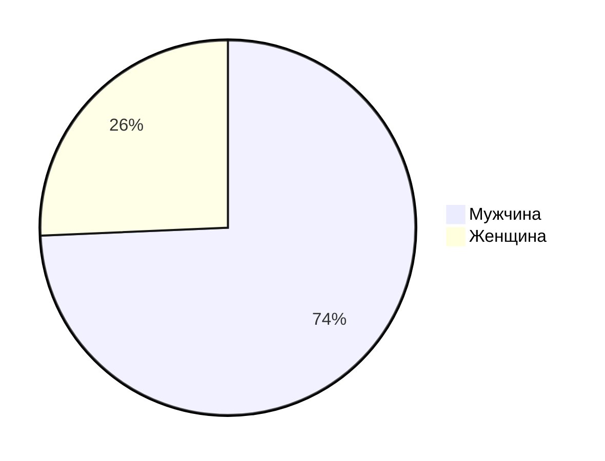

# Kick

## 1. Тема и целевая аудитория

**Kick** - платформа для онлайн-стриминга, где пользователи могут взаимодействовать со стримерами и общаться с другими через публикации, чаты и другие функции. Одним из ключевых технических отличий Kick от Twitch является более высокая степень настройки и контроля для стримеров, позволяющая им добавлять собственные фильтры и плагины, а также использовать меньшую задержку стрима, которая может достигать всего несколько секунд. Это создает более интерактивный опыт как для зрителей, так и для стримеров, в отличие от Twitch, где задержка может быть значительно выше. Кроме того, Kick предлагает более выгодные условия для монетизации контента, что привлекает новых создателей.

### MVP

- регистрация и авторизация пользователей
- онлайн трансляции
- система чата
- система рекомендаций каналов зрителям по схожим интерсам
- страница канала
- подписка на канал
- монетизация стримеров

### Ключевой функционал

- модерация чата
- гифки и смайлики для чата
- сохранение лучших моментов с трансляций как зрителями, так и стримерами
- сохранение прямых трансляций до 30 дней
- картинка в картинке (видеоплеер)

### Целевая аудитория

Согласно статистике с сайта [similarweb](https://www.similarweb.com/website/kick.com) Kick имеет следующие метрики:

- ежемесячные уникальные посетители (MAU): 32 млн
- ежедневные уникальные посетители (DAU): 3.6 млн
- среднее время посещения веб сайта: 7 минут 53 секунд
- bounce rate: 40.67 %
- ежедневные просмотры страниц: 16 млн

### Распределение аудитории по устройствам

### Количество посетителей по странам

### Распределение пользователей по возрастным группам

### Распределение посетителей по гендеру

## 2. Расчет нагрузки

### Продуктовые метрики

- Месячная аудитория: 32 млн
- Дневная аудитория: 3.6 млн
- Средний размер хранилища пользователя:

| Хранимые данные         | Средний размер ед. | Единиц/пользователь | Количество единиц | Суммарный объем |
| ----------------------- | ------------------ | ------------------- | ----------------- | --------------- |
| Канал пользователя      |
| Клипы пользователя      |
| Видео пользователя      |
| Чат пользователя        |
| Сообщения пользователя  |
| История просмотра       |
| История платежей        |
| Подписчики пользователя |

> **Примечание:**
>
> - Сообщения пользователя включают в себя смайлики, текст и гифки.
> - Чат пользователя — это чат, который всегда работает на его канале (скорее всего, кешируется история на некоторое время).

- Среднее количество действий пользователя по типам в день:

| Действие пользователя              | Среднее кол-во в день |
| ---------------------------------- | --------------------- |
| Регистрация                        |
| Авторизация                        |
| Создание трансляции                |
| Отправка сообщения в чат           |
| Обновление страницы (рекомендации) |
| Просмотр своего канала             |
| Редактирование своего канала       |
| Просмотр онлайн трансляции         |
| Отслеживание канала                |
| Оплата подписки                    |
| Удаление сообщений                 |
| Блокировка других пользователей    |
| Создание клипа                     |
| Сохранение трансляции              |
| Просмотр видеоплеера               |
| Пожаловаться на трансляцию         |

> **Примечание:**
>
> -
