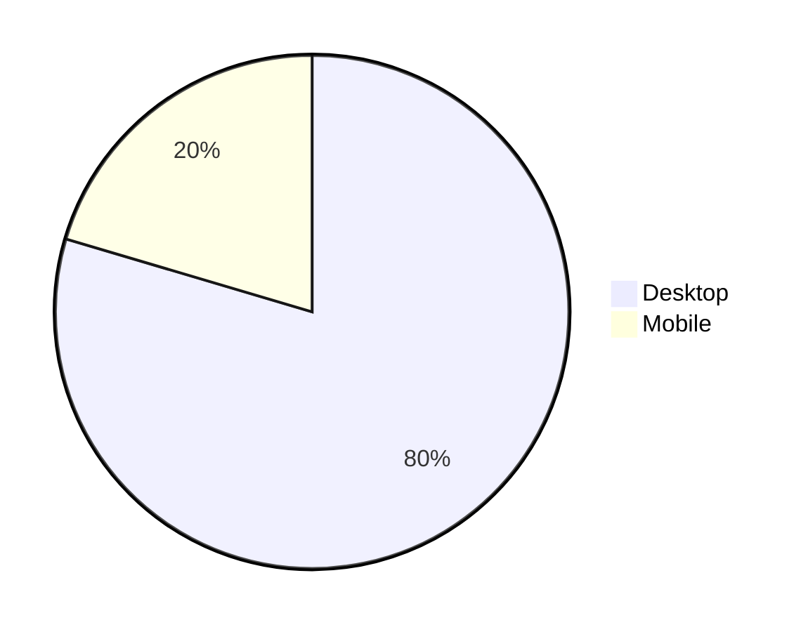
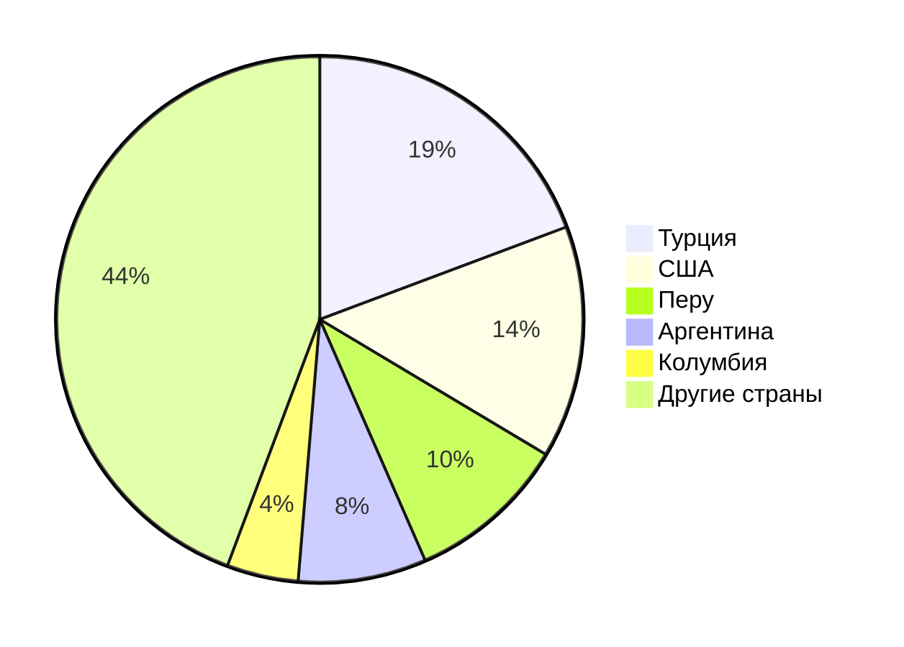
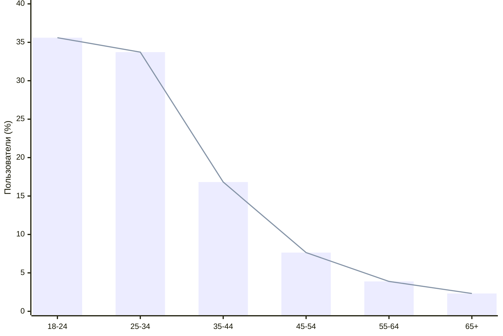
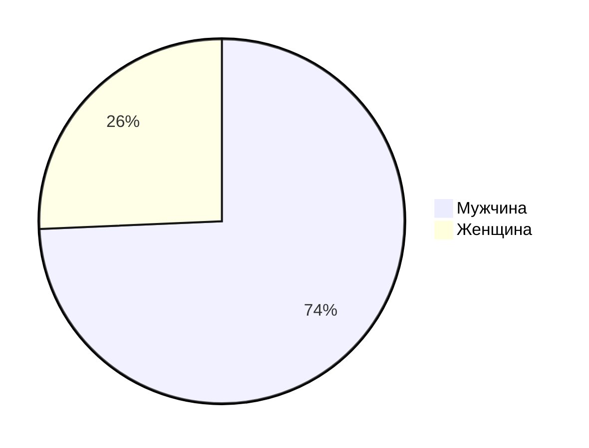

# Kick

## 1. Тема и целевая аудитория

**Kick** - платформа для онлайн-стриминга, где пользователи могут взаимодействовать со стримерами и общаться с другими через публикации, чаты и другие функции. Одним из ключевых технических отличий Kick от Twitch является более высокая степень настройки и контроля для стримеров, позволяющая им добавлять собственные фильтры и плагины, а также использовать меньшую задержку стрима, которая может достигать всего несколько секунд. Это создает более интерактивный опыт как для зрителей, так и для стримеров, в отличие от Twitch, где задержка может быть значительно выше. Кроме того, Kick предлагает более выгодные условия для монетизации контента, что привлекает новых создателей.

### MVP

- регистрация и авторизация пользователей
- онлайн трансляции
- система чата
- система рекомендаций каналов зрителям по схожим интерсам
- страница канала
- подписка на канал
- монетизация стримеров

### Ключевой функционал

- модерация чата
- гифки и смайлики для чата
- сохранение лучших моментов с трансляций как зрителями, так и стримерами
- сохранение прямых трансляций до 30 дней
- картинка в картинке (видеоплеер)

### Целевая аудитория

Согласно статистике с сайта [similarweb](https://www.similarweb.com/website/kick.com) Kick имеет следующие метрики:

- ежемесячные уникальные посетители (MAU): 32 млн
- ежедневные уникальные посетители (DAU): 3.6 млн
- среднее время посещения веб сайта: 7 минут 53 секунд
- bounce rate: 40.67 %
- ежедневные просмотры страниц: 16 млн

### Распределение аудитории по устройствам

### Количество посетителей по странам

### Распределение пользователей по возрастным группам

### Распределение посетителей по гендеру

## 2. Расчет нагрузки

### Продуктовые метрики

- Месячная аудитория: 32 млн
- Дневная аудитория: 3.6 млн
- Средний размер хранилища пользователя:

Число зарегистрированных пользователей ~50 млн

| Хранимые данные                         | Средний размер ед. | Единиц/пользователь | Общее количество | Суммарный объем |
| --------------------------------------- | ------------------ | ------------------- | ---------------- | --------------- |
| Канал пользователя                      | 500 КБ             | 1                   | 50 млн           | 23,28 ТБ        |
| Клипы пользователя                      | 40 МБ              | 10                  | 500 млн          | 18,63 ПБ        |
| Трансляции пользователя                 | 1.5 ГБ/час         | 20                  | 100 млн часов    | 143,05 ПБ       |
| Сообщения пользователя(текст)           | 100 Б              | 5                   | 250 млн          | 23,28 ГБ        |
| Сообщения пользователя(гифки и стикеры) | 30 КБ              | 10                  | 500 млн          | 13,97 ТБ        |
| История просмотра                       | 5 КБ               | 1                   | 50 млн           | 238,42 ГБ       |
| История платежей                        | 1 КБ               | 1                   | 12.5             | 11,92 ГБ        |
| Подписчики пользователя                 | 500 Б              | 10                  | 500 млн          | 232,83 ГБ       |

Суммарный размер хранилища: 161,72 ПБ. Из которых 99% занимают клипы и трансляции.

Возможный прирост хранимых данных: Kick был создан в 2022 году и за 2 года набрал 50 млн зарегистрированных пользователей. 2 \* 365 = 730. Средний ежедневный прирост: 50 млн / 730 дней = 68493.15 ~ 68 тыс пользователей ежедневно.
Канал пользователя: 68 тыс \* 500 КБ = 34 ГБ ежедневно.
Клипы пользователей: из 3.6 млн DAU только 30 % создают клипы => 1.08 млн \* 40 МБ = 38.88 ТБ ежедневно
Трансляции пользователей: возможный средний прирост DAU за год ~10-15%. Тогда объем хранимых трансляций увеличится тоже примерно на 10-15% => 143.05 \* 1.15 = 164.5 ПБ постоянно хранимых трансляций. Тогда ежедневный прирост: (164.5 - 143.05)/365 = 0.06 ПБ.
Сообщения пользователя(гифки и стикеры): 3.6 млн \* 10 = 36 млн сообщений отправляется ежедневно => 36 млн \* 30 КБ = 1.08ТБ ежедневно.
Тогда суммарный ежедневный прирост хранимых данных: 0.098 ПБ. Тогда месячный прирост: 2.93 ПБ, а годовой - 35.16 ПБ.

> **Примечание:**
>
> - Сообщения пользователя включают в себя стикеры, текст и гифки.
> - Чат пользователя — это чат, который всегда работает на его канале (скорее всего, кешируется история на некоторое время).
> - Канал пользователя: аватарка(~15 КБ) + шапка(~100 КБ) + описание(100 Б) + баннеры с рекламой(~300 КБ) + различные сслыки на соц. сети и >реклама (1 КБ) = 416100Б. Учтем погрешность и округлим до 500 КБ.
> - Клипы пользователя: в среднем у пользователя 10 клипов, один клип может быть от 30 до 50 сек. => средний размер клипа 40 МБ.
> - Трансляции пользователя: в среднем у одного стример 10 трансляций, их средняя продолжительность - 2 часа => единиц/пользователь = 20 часов.
>   Т.к. стримерами являются только ~10% процентов от всех пользователей, то общее количество = 50 млн \* 0.1 \* 20 = 100 млн часов.
>   Тогда суммарный объем: 1.5 \* 100 \* 10^6 = 143,05 ПБ.
> - Сообщения пользователя прилагаются к трансляции, трансляция сохраняется до 30 дней => сообщения хранятся максимум 30 дней, но нужно учесть, >что не все трансляции сохраняются, некоторые трансляции удаляются до истечения 30 дней. Среднее количество хранимых трансляций 50 млн. На >одного пользователя в среднем приходится 15 (5 - текст, 10 - гифки и стикеры) сообщений => постоянное количество хранимы текстовых сообщений >всех пользователей: 5 \* 50 млн = 250 млн, а гифок и стикеров всего: 10 \* 50 млн = 500 млн.
> - История платежей: не все пользователи производят оплату => всего пользователей: 50 \* 0.25 = 12.5 млн.

- Среднее количество действий пользователя по типам в день:

Согласно данным с сайта [hypestat](https://hypestat.com/info/kick.com) за один визит пользователь просматривает 4.45 страниц, а ежедневные просмотры страниц составляют 15,908,374 ~ 16 млн страниц.
Пусть в среднем один пользователь создает 1.5 сесси в день. Тогда всего пользователь просматривает 4.45 \* 1.5 ~ 7 страниц.

| Действие пользователя              | Среднее кол-во в день для одного юзера | RPS  | Пиковый RPS |
| ---------------------------------- | -------------------------------------- | ---- | ----------- |
| Регистрация и Авторизация          | 0.1                                    | 4.2  | 8.4         |
| Создание трансляции                | 0.025                                  | 1    | 2           |
| Отправка сообщения в чат           | 1.5                                    | 62.5 | 125         |
| Обновление страницы (рекомендации) | 2                                      | 83.3 | 166.6       |
| Просмотр своего канала             | 0.1                                    | 4.2  | 8.4         |
| Редактирование своего канала       | 0.01                                   | 0.42 | 0.84        |
| Просмотр онлайн трансляции         | 2.4                                    | 100  | 200         |
| Отслеживание канала                | 0.2                                    | 8.33 | 16.66       |
| Оплата подписки                    | 0.02                                   | 0.83 | 1.66        |
| Удаление сообщений                 | 0.05                                   | 2.08 | 4.16        |
| Блокировка других пользователей    | 0.01                                   | 0.42 | 0.84        |
| Создание клипа                     | 0.12                                   | 5.0  | 10          |
| Сохранение трансляции              | 0.03                                   | 1.25 | 2.5         |
| Просмотр видеоплеера               | 1                                      | 41.7 | 83.4        |
| Пожаловаться на трансляцию         | 0.0005                                 | 0.02 | 0.04        |

Расчёт RPS был проведён по формуле: PRS = (Среднее кол-во в день для одного юзера) \* DAU / 86400.
Суммарный RPS: 315, а пиковый RPS = RPS \* 2 = 630.

> **Примечание:**
>
> - Регистрация и Авторизация: Kick хранит сессию 30 дней => если пользователь не выходит сам,
>   то ему приходится авторизовываться только один раз в 30 дней + добавим погрешность, тогда получим 0.1
> - Создание трансляции: только 10 % пользователей являются стримерами и только 25 % из них запускают стрим в этот день
>   => всего пользователей запускающих трансляцию в данный день: 3.6 млн \* 0.1 \* 0.25 = 90 тысяч. 90000/3600000 \* 100 % = 2.5 % от всех
>   ежемесячных уникальных пользователей. В среденем один стример запускает одну трансляцию в день, тогда 0.025 \* 1 = 0.025.
> - Отправка сообщения в чат: 30 % зрителей пишут сообщения в чат, тогда это 1.08 млн в день зрителей. Пусть в среднем один зритель отправляет 5 сообщений за трансляцию, тогда всего в день отправляется 5.4 млн сообщений.
> - Просмотр своего канала: пусть 10 % от всех пользователей в данный день заходят на свой канал.
> - Просмотр онлайн трансляции: ~80 % переходят на трансляцию, в среднем просматривается 3 трансляции. (3.6 \* 0.8 \* 3) / 3.6 = 2.4
> - Оплата подписки: 20 % от всех пользователей Kick имеют платную подписку => 3.6 \* 0.2 = 720 тыс являются платными подписчиками в данный день и только у 10 % из них она заканчивается в данный день => 720 \* 0.1 = 72000 -> 72000 / 3600000 = 0.02.
> - Удаление сообщений: всего стримеров 3.6 \* 0.1 = 360 тыс. У каждого стримера в среднем 0.5 модераторов = > 360000 \* 0.5 = 180 тыс модераторов.
> - Создание клипа: активных пользователей - 1.08 млн, из них 40 % создают клипы. Тогда 1.08 \* 0.4 = 432 тыс.
> - Сохранение трансляции: 10 % пользователей - стримеры и 30 % из них сохраняют свои трансляции.
> - Пожаловаться на трансляцию: [pdf](https://kickcommunity.com/content/files/2025/02/KICK-Streaming-Transparency-Report-H2-2024.pdf) исходя из данных, которые предоставил Kick за вторую половину 2024 года можно сделать заключение касаемо жалоб. Всего 345,873 тыс жалоб за 6 месяцев или 182 дня. Тогда это ~1900 жалоб в день.

### Технические метрики

- Размер хранения в разбивке по типам данных (в штуках и в Тб) - для существенных блоков данных: [таблица](#продуктовые-метрики)</a>.
- Сетевой трафик:

| Действие пользователя              | Средний трафик на одно действие (МБ) | Нагрузка на сеть (Гбит/с) |
| ---------------------------------- | ------------------------------------ | ------------------------- |
| Регистрация и Авторизация          | 0.2                                  | 0.00656                   |
| Создание трансляции                | 0.2                                  | 0.00156                   |
| Отправка сообщения в чат           | 0.00045                              | 0.00022                   |
| Обновление страницы (рекомендации) | 2                                    | 1.30156                   |
| Просмотр своего канала             | 2.5                                  | 0.08203                   |
| Редактирование своего канала       | 0.002                                | 0.00001                   |
| Просмотр онлайн трансляции         | 3                                    | 2.34375                   |
| Отслеживание канала                | 0.001                                | 0.00007                   |
| Оплата подписки                    | 0.001                                | 0.00001                   |
| Удаление сообщений                 | 0.0003                               | ~0                        |
| Блокировка других пользователей    | 0.0004                               | ~0                        |
| Создание клипа                     | 2                                    | 0.07813                   |
| Сохранение трансляции              | 10                                   | 0.09766                   |
| Просмотр видеоплеера               | 1                                    | 0.32500                   |
| Пожаловаться на трансляцию         | 0.0005                               | ~0                        |

**Нагрузка на сеть** была расчитана по формуле: Нагр. на сеть = (ср. трафик на действие) \* RPS \* 8/ 1024.

Средний сетевой трафик на одного пользователя: 0.02 Гбит/день.
Суммарная нагрузка на сеть: ~4.236 Гбит/с. Тогда пиковая нагрузка 2 \* 4.236 = 8.472 Гбит/с.

## 3. Глобальная балансировка нагрузки

- Функциональное разбиение по доменам:

  - kick.com - основной домен
  - dashboard.kick.com - панель управления автора
  - kickcommunity.com - сообщество Kick
  - shop.kick.com - официальные товары товары под брендом Kick
  - dev.kick.com - собственные технологии разработки, которые предлагает Kick разработчикам
  - docs.kick.com - документация
  - help.kick.com - поддержка Kick
  - files.kick.com - для статики

- Обоснования расположения ДЦ:

Для обоснования расположения ДЦ воспользуемся метриками предоставленными в [статистике: Количество посетителей по странам](#количество-посетителей-по-странам)</a>. Из таблицы видно, что значительная часть пользователей находится в Северной и Южной Америке, а также в Турции (регион Европы). Остальные 44,3% пользователей распределены между прочими странами и континентами. Соответственно, наибольшее количество дата-центров следует разместить в Северной Америке, Южной Америке и Европе, а остальные – в крупнейших точках обмена трафиком.

При выборе конкретного города в стране нужно опираться на распределение числа жителей по городам [luminocity3d](https://luminocity3d.org/WorldPopDen/#3/20.00/10.00).

1. Турция и европейские страны:

2. США:

3. Южная Америка:

Общая карта расположения ДЦ:

[Карта](https://yandex.ru/maps/?um=constructor%3A1f080090fb3358f7959eb45b6587b01d561afd545f5b63896166780784fb387a&source=constructorLink)

- Расчет распределение запросов:

Всего ДЦ: 12 шт.

Каждый ДЦ должен:

- обслуживать одинаковое среднее кол-во DAU: 3.6 млн / 12 = 300000 пользователей
- иметь одинаковое кол-во RPS: 315/12 = 26.25. Тогда пиковый RPS, который может приходиться на один ДЦ: 26.25 \* 2 = 52.5.

- Схема DNS балансировки:

В рамках DNS балансировки будет применяться алгоритм, основанный на минимизации задержки (latency-based DNS). Такая схема позволяет направлять запросы пользователей к ближайшему дата-центру с минимальным временем отклика (RTT) и будет реализована по всему миру.

- Схема Anycast балансировки:

Для Anycast балансировки планируется использование BGP Anycast, что обеспечивает маршрутизацию трафика на основе оптимальных сетевых путей. Данная схема применяется внутри регионов для достижения минимальной задержки и высокой отказоустойчивости.

## 4. Локальная балансировка нагрузки

### Балансировка

- В качестве локальной балансировки мы будем использовать архитектурный паттерн L7 Sidecar Proxy. На каждый хост ставим локальный прокси — это будет Envoy, поскольку конфиги из центрального хранилища удобнее загружать именно в него, чем, например, в Nginx. К тому же Envoy считается более гибким. Такая схема позволит сэкономить 1 миллисекунду, что может быть критичным для стримингового сервиса.

- Алгоритм для L7 балансировки - Round Robin, т.к. Least connection хорошо для блокирующего софта, я буду использовать асинхронный подход в приложениях.

- Для отказоустойчивости необходима обработка вероятности смерти самой машины, на которой стоит proxy, т.к. сама по себе L7 балансировка очень надежна.

- Также будем использовать систему оркестрации Kubernetes, которая позволит автоматизировать развертывание приложения, упростит масштабирование и повысит отказоустойчивость.

### SSL Termination

Сама по себе SSL Termination очень дорогостоящая операция как по времен, так и по использованию CPU. Для решения этих проблем предлагается следующая схема терминации:

- С помощью DNS направляем весь входящий трафик в один дата-центр (чтобы не расщеплять трафик по миру).

- Внутри этого ДЦ выполняем распределение на хосты, причём все хосты используют один и тот же IP. При этом у нас включены Session Tickets, что упрощает повторные подключения и снижает нагрузку на CPU при установке зашифрованных соединений.

## 5. Логическая схема БД

### Иллюстрация

[Схема](https://dbdiagram.io/d/Highload-67d7d99175d75cc84454e076)

| Таблица         | Описание                                                                        |
| --------------- | ------------------------------------------------------------------------------- |
| user            | Хранит данные о пользователе                                                    |
| channel         | Хранит данные о канале, который пренадлежит пользователю                        |
| stream          | Хранит данные о трансляциях, которые были когда либо проведены на данном канале |
| video           | Хранит ссылки на записи трансляций данного канала                               |
| сlips           | Хранит ссылки на записи клипов для данной трансляции                            |
| subscription    | Хранит данные о платных подписках пользователя                                  |
| follow          | Хранит данные о бесплатных подписках пользователя                               |
| message         | Хранит данные о сообщениях в чате для данного стрима                            |
| gif             | Хранит данные о всех гифках, которые есть на платформе Kick                     |
| category        | Хранит данные о всех категориях, которые есть на платформе Kick                 |
| tag             | Хранит данные о всех тегах, которые есть на платформе Kick                      |
| banner          | Хранит данные баннерах канала                                                   |
| message_gif     | Связующая таблица для создания связи многие ко многим                           |
| stream_category | Связующая таблица для создания связи многие ко многим                           |

> **Примечание:**
>
> - Таблица user: monetization будет сигнализировать о том есть ли у стримера монетизация
> - Для таблиц video, clips, gif, banner будет хранить source url на метаданные

### Размер данных

#### user

- user_id: 32 байта
- nickname: 25 байт
- email: 35 байт
- password_hash: 256 байт
- monetization: 1 байт
- birth_date date: 4 байта
- created_at: 8 байт
- updated_at: 8 байт
  Сумма: 369 байт; всего: 369 \* 50 млн = 17,18 ГБ.

#### channel

- channel_id: 32 байта
- user_id: 32 байта
- description: 500 байт
- avatar_url: 128 байт
- head_banner_url: 128 байт
- offline_banner_url: 128 байт
- created_at: 8 байт
- updated_at: 8 байт
  Сумма: 964 байт; всего: 964 \* 50 млн = 44,89 ГБ.

#### stream

- stream_id: 32 байта
- channel_id: 32 байта
- title: 140 байт
- stream_url: 128 байт
- key: 128 байт
- created_at: 8 байт
- ended_at: 8 байт
  Сумма: 476 байт; всего: 476 \* 50 млн = 22,17 ГБ.

#### category

- category_id: 32 байта
- name: 20 байт
- created_at: 8 байт
- updated_at: 8 байт
  Сумма: 68 байт; всего: 68 \* 10000 = 680 КБ.

#### video

- video_id: 32 байта
- channel_id: 32 байта
- stream_id: 32 байта
- title: 140 байт
- source_url: 128 байт
- uploaded_at: 8 байты
  Сумма: 372 байт; всего: 372 \* 50 млн = 17,32 ГБ.

#### clips

- clip_id: 32 байта
- stream_id: 32 байта
- channel_id: 32 байта
- title: 50 байт
- stream_url: 128 байт
- source_url: 128 байт
- uploaded_at: 8 байт
  Сумма: 410 байт; всего: 410 \* 50 млн = 19,09 ГБ.

#### subscription

- subscription_id: 32 байта
- user_id: 32 байта
- channel_id: 32 байта
- start_date: 8 байт
- end_date: 8 байт
- created_at: 8 байт
  Сумма: 120 байт; всего: 120 \* 20 млн = 2.4 ГБ.

#### follow

- follow_id: 32 байта
- user_id: 32 байта
- channel_id: 32 байта
- followed_at: 8 байт
  Сумма: 104 байт; всего: 104 \* 500 млн = 52 ГБ.

#### message

- message_id: 32 байта
- user_id: 32 байта
- stream_id: 32 байта
- message: 500 байт
- gif_id: 32 байта
- created_at: 8 байт
  Сумма: 636 байт; всего: 636 \* 500 млн = 296,16 ГБ.

#### gif

- gif_id: 32 байта
- gif_name: 20 байт
- source_url: 128 байт
  Сумма: 180 байт; всего: 180 \* 100 тыс = 17,17 МБ.

#### tag

- tag_id: 32 байта
- tag_name: 20 байт
- created_at: 8 байт
  Сумма: 60 байт; всего: 60 \* 100 = 600 Б.

#### banner

- banner_id: 32 байта
- channel_id: 32 байта
- name: 100 байт
- description: 1000 байт
- source_url: 128 байт
- created_at: 8 байт
- updated_at: 8 байт
  Сумма: 1308 байт; всего: 1308 \* 100 млн = 12,18 ГБ.

#### stream_counter

- counter_id: 32 байта
- view_count: 4 байта
- stream_id: 32 байта
- created_at: 8 байт
- updated_at: 8 байт

#### recommendation

- recommendation_id: 32 байта
- user_id: 32 байта
- content_type: 20 байт
- content_id: 32 байта
- created_at: 8 байт

Суммарный объем БД: ~500 ГБ.

## 6. Физическая схема БД

| Таблица        | СУБД          | Индексы             | Шардирование                |
| -------------- | ------------- | ------------------- | --------------------------- |
| user           | PostgreSQL    | email, nickname     | user_id                     |
| auth_session   | Tarantool     |                     | Шардинг хешами              |
| channel        | PostgreSQL    | user_id             | channel_id                  |
| stream         | PostgreSQL    | channel_id          | channel_id                  |
| video          | PostgreSQL    | channel_id          | channel_id                  |
| сlips          | PostgreSQL    | stream_id           | channel_id                  |
| subscription   | PostgreSQL    | user_id, channel_id | user_id                     |
| follow         | Cassandra     | channel_id, user_id | Автоматическое шардирование |
| message        | Cassandra     | user_id, message_id | Автоматическое шардирование |
| gif            | PostgreSQL    | gif_name            |                             |
| category       | PostgreSQL    | name                |                             |
| tag            | PostgreSQL    | tag_name            |                             |
| banner         | PostgreSQL    | channel_id          | channel_id                  |
| stream_counter | Tarantool     |                     | Шардинг хешами              |
| recommendation | Elasticsearch |                     | Автоматическое шардирование |
| Облако         | HDFS          |                     |                             |
