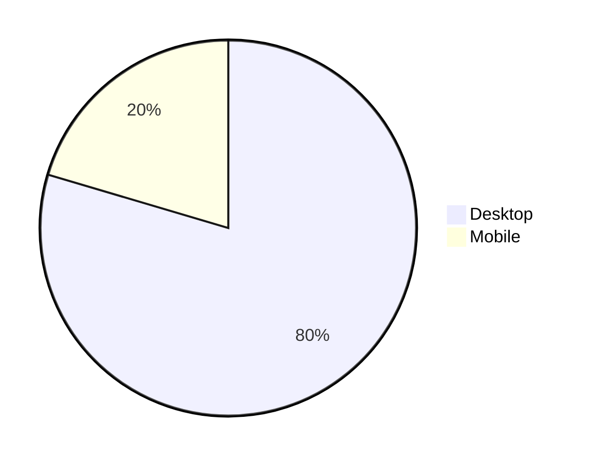
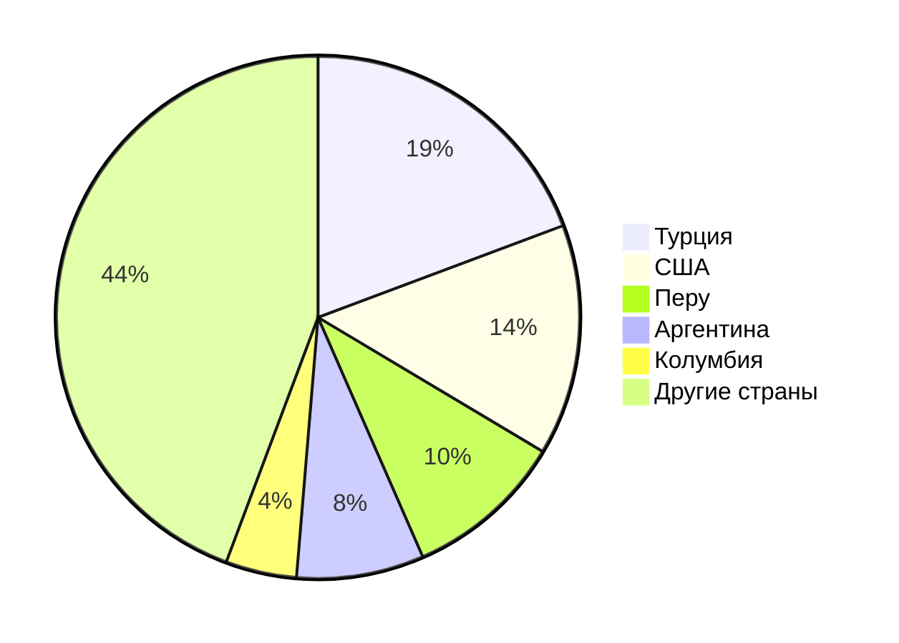
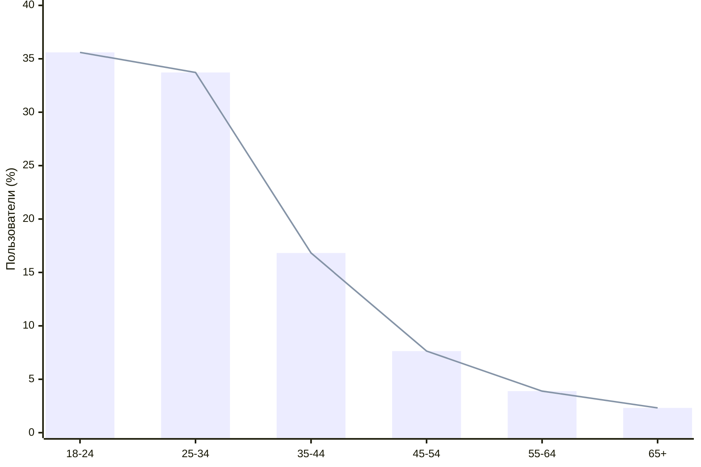
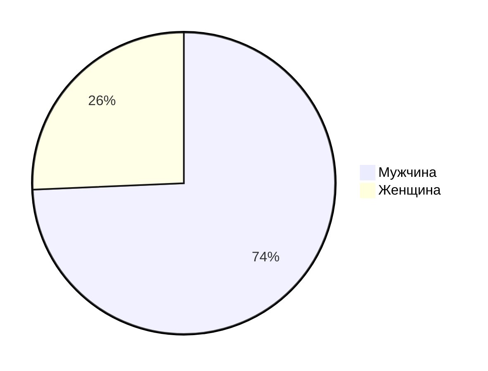

# Kick

## 1. Тема и целевая аудитория
**Kick** - платформа для онлайн-стриминга, где пользователи могут взаимодействовать со стримерами и общаться с другими через публикации, чаты и другие функции.

### Функционал MVP
- регистрация и авторизация пользователей
- онлайн трансляции
- система чата
- система рекомендаций каналов зрителям по схожим интерсам
- страница канала
- модерация чата и контента
- монетизация стримеров
- поиск пользователей

### Целевая аудитория
Согласно статистике с сайта [similarweb](https://www.similarweb.com/website/kick.com) Kick имеет следующие метрики:
- ежемесячные уникальные посетители (MAU): 32 млн
- среднее время посещения веб сайта: 7 минут 53 секунд
- bounce rate: 40.67 %
- ежедневные просмотры страниц: 16 млн

### Распределение аудитории по устройствам

### Количество посетителей по странам

### Распределение пользователей по возрастным группам

### Распределение посетителей по гендеру

